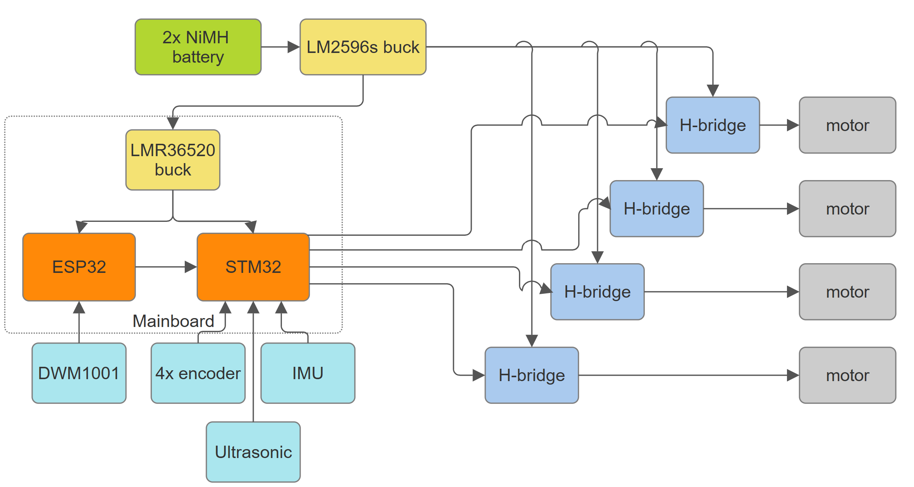
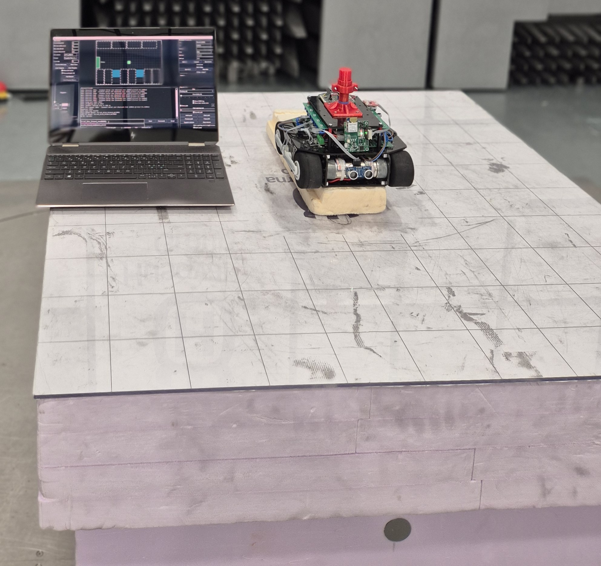
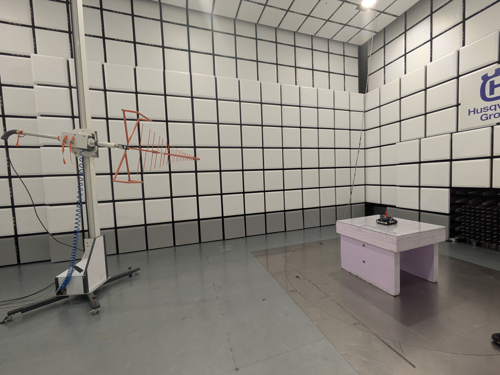
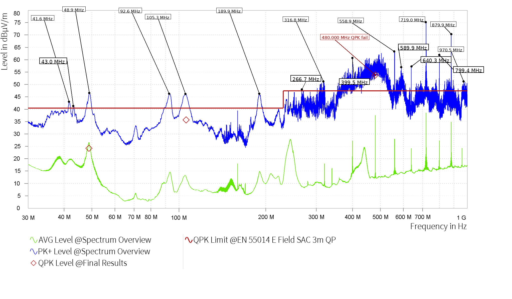
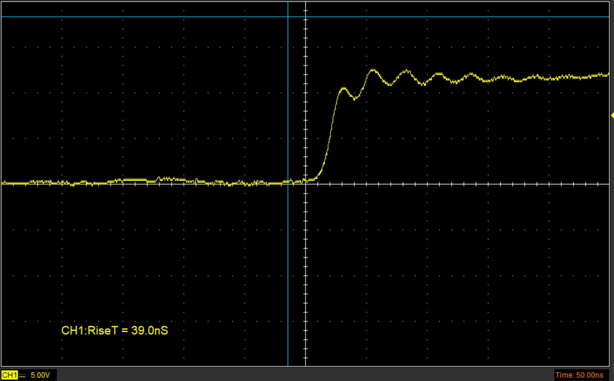

# Identifying Applicable Regulatory EMC Requirements and Pre-Compliance EMC Testing for an Autonomous Parking Robot
*Author: Hampus Huus*

## Introduction

Electromagnetic compatibility (EMC) is an important consideration when developing autonomous robotic systems (AGV), because such systems often combine several electronic functions that can generate both conducted and radiated electromagnetic disturbances. If these disturbances are not properly considered, they may cause unacceptable interference with other equipment in the intended environment. European Union regulatory requirements therefore exist to limit such interference, and failure to meet them may prevent the product from being placed on the market or, if already made available on the market, may lead to corrective actions such as withdrawal or even recall. This report investigates which European Union (EU) regulatory EMC requirements and harmonised standards are relevant for this type of system. Because full standard documents are typically licence-based and costly, the project focuses on pre-compliance instead, using a limited set of operating modes and a small number of measurements and mitigation experiments.

## System description and EMC-relevant hardware

The autonomous robot platform (AGV), as shown in Figure fig:agv-system-overview, consists of two NiMH batteries connected in series and a control system built around a mainboard, four separate H-bridge PCBs, sensors, and wireless communication modules. An adjustable LM2596S-based switching regulator is connected directly after the batteries and provides the supply for the H bridge PCBs. The mainboard contains an STM32-based controller for motor control and sensor acquisition, an ESP32-based controller for higher-level communication, and an LMR36520 buck converter for the 3.3 V logic supply. The platform also includes a DWM1001 UWB module, an LSM9DS1 IMU, four AS5600 wheel-position sensors, and ultrasonic distance sensors, all of which are connected to the mainboard using ribbon cables.

*System overview of the AGV.*

The following subsections go through the main parts of the AGV and assess whether they may be potential emission sources, or may contribute to EMC problems through wiring, switching behaviour, or coupling paths. The purpose is not to declare compliance at this stage, but to build a basis for the later measurement work and to support the investigation if significant emissions are found during pre-compliance testing.

### Encoders

The four AS5600 wheel position sensors are read using $230\,Hz$ PWM outputs. Each sensor is connected to the mainboard by an approximately $20\,cm$ cable carrying $3.3\,V$, GND, and PWM. For later EMC analysis, the relevant output parameters from the datasheet [ref:as5600-datasheet] are a PWM slew rate of $0.5$ to $2\,V/\mu s$ and an output current of $0.5\,mA$. The corresponding rise-time-based frequency estimate is:

$$
f_r = \frac{dV/dt}{3.3} = \frac{0.5 \text{ to } 2}{3.3} = 152 \text{ to } 606\,kHz
$$

These values are used as a conservative estimate of the frequency range where the encoder signal edges may still have relevant spectral content. The highest value, $606\,kHz$, is therefore used for the cable length comparison instead of only using the $230\,Hz$ PWM repetition frequency.

$$
\lambda = \frac{c}{f} = \frac{299\,792\,458}{606\,000} = 494.7\,m
$$

For the approximately $0.2\,m$ encoder cable, the ratio between cable length and wavelength is:

$$
\frac{L}{\lambda} = \frac{0.2}{494.7} = 4.04 \times 10^{-4}
$$

This is much smaller than $0.1$, which is equivalent to the common rule of thumb $L < 0.1\lambda$ for treating a structure as electrically small [ref:paul-emc]. The encoder cable is therefore electrically very short even when the edge based frequency estimate is used. This supports treating the encoder cables as a low radiated emission risk compared with faster and higher current parts of the AGV, such as the H bridge PCBs and motor wiring.

### IMU

The LSM9DS1 IMU [ref:lsm9ds1-datasheet] is connected to the mainboard through an SPI interface with a ribbon cable that is at maximum $20\,cm$. In the present design, the SPI clock is set by:

$$
f_{SPI} = \frac{170\,MHz}{64} = 2.65625\,MHz
$$

The corresponding wavelength is:

$$
\lambda = \frac{c}{f} = \frac{299\,792\,458}{2\,656\,250} = 112.86\,m
$$

For the approximately $0.2\,m$ IMU cable, the ratio between cable length and wavelength at the SPI clock frequency is:

$$
\frac{L}{\lambda} = \frac{0.2}{112.86} = 1.77 \times 10^{-3}
$$

The cable is electrically short at the SPI clock frequency. However, the SPI edges can still contain higher frequency components than the clock frequency itself. Since the SPI slew rate is not currently known, it must be measured before the radiated emission risk from the SPI interface can be estimated more accurately.

### Ultrasonic

The HC-SR04 ultrasonic sensor [ref:hc-sr04-datasheet] is connected to the mainboard through VCC, GND, Trigger, and Echo. The Trigger input is a TTL pulse of at least 10 $\mu$s, and the Echo output is a TTL pulse whose width is proportional to the measured distance. The module operates from 5 $\mathrm{V}$ with a typical working current of 15 $\mathrm{mA}$. The 40 $\mathrm{kHz}$ ultrasonic burst is generated internally by the module after the Trigger pulse, rather than being directly carried on the interface cable. The datasheet [ref:hc-sr04-datasheet] does not specify the rise time, fall time, or slew rate of the Trigger and Echo signals. For later radiated-EMC analysis, these edge rates must therefore be measured on the implemented hardware.

### Batteries

The platform is powered by two NiMH batteries connected in series. The battery cells are not switching sources themselves and are therefore not treated as an active radiated emission source. The EMC relevance is instead the battery wiring, since it is part of the power path that supplies the H bridge PCBs and switching regulators.

For radiated emission, the important factor is whether transient current flows in a large supply loop. In differential mode, the outgoing and returning current form a current loop that creates a magnetic field. For a simple two-wire loop, the loop area can be approximated as $A \approx ls$, where $l$ is the loop length and $s$ is the separation between the supply and return conductors. The battery harness is therefore relevant if the supply and return wiring are separated enough to create a large loop carrying H bridge current transients.

### Mainboard

The mainboard is the common PCB for the STM32 controller, ESP32 controller, sensor connectors, UWB connector, and motor-control connections. It also includes the LMR36520 buck converter for the 3.3 V logic supply. The individual circuits are described in later sections, so the EMC focus here is the routing on the mainboard and how the signal return currents are handled.

The mainboard carries several different signal types. The AS5600 encoder signals are captured as PWM signals at approximately $230\,Hz$. The motor control PWM signals are approximately $20\,kHz$. The DWM1001 UWB module communicates over UART at $115200\,baud$, and the UART between the ESP32 and STM32 also uses $115200\,baud$. The LSM9DS1 IMU is connected over SPI. In the present design the STM32 SPI clock is:

$$
f_{SPI} = \frac{170\,MHz}{64} = 2.65625\,MHz
$$

The nominal frequencies are therefore:

$$
f_{encoder} = 230\,Hz
$$

$$
f_{motorPWM} = 20\,kHz
$$

$$
f_{UART} \approx 115.2\,kHz
$$

$$
f_{SPI} = 2.65625\,MHz
$$

For the mainboard traces themselves, these frequencies are not high enough to make a short PCB trace an efficient radiator by length alone. This can be checked using the wavelength relation:

$$
\lambda = \frac{v}{f}
$$

This relation is used when discussing electrical dimensions, where the important quantity is conductor length compared with wavelength rather than physical length alone. For the highest nominal mainboard signal frequency, $2.65625\,MHz$, the wavelength is:

$$
\lambda_{SPI} = \frac{3 \cdot 10^8}{2.65625 \cdot 10^6} = 112.9\,m
$$

For a typical $50\,mm$ mainboard trace this gives:

$$
\frac{L}{\lambda} = \frac{0.05}{112.9} = 4.43 \cdot 10^{-4}
$$

This is far below $0.1$, which is equivalent to the common rule of thumb $L < 0.1\lambda$ for treating a structure as electrically small [ref:paul-emc]. Therefore, the SPI trace length itself is not expected to be the dominant radiated-emission problem. The encoder PWM, motor PWM logic signal, and UART traces have even lower nominal frequencies, so their wavelength-based trace-length risk is lower than the SPI case.

This does not mean that the mainboard layout is irrelevant. Digital signals contain high-frequency components depending on rise and fall time, and PCB design must control return paths and loop areas [ref:paul-emc]. Therefore, the important mainboard issue is not the nominal frequency alone, but whether the outgoing trace and its return current stay close together. If a signal trace crosses a weak or broken ground return, the return current must take a longer path. This increases loop area and can increase magnetic coupling and radiated emission.

The pre-compliance measurements for the mainboard should therefore focus on signal quality and coupling, rather than treating the short PCB traces as antennas.

The main EMC concern on the mainboard is therefore the LMR36520 buck layout rather than the short logic traces. The buck has a local high-frequency current loop between the input capacitor, the switching path, ground, and back to the input capacitor. This loop should be kept small, because loop inductance creates voltage disturbance when the current changes quickly:

$$
V_L = L \frac{di}{dt}
$$

For this mainboard, the return path is made with copper pours and several vias instead of a continuous ground plane. This makes via placement important, especially around the buck. The input capacitor is placed close to the buck, and the buck ground return to the input capacitor ground through several nearby vias instead of one shared narrow return path. This reduces common impedance and local ground bounce in the switching current path.

The SW node, i.e. the switching node between the buck regulator and the inductor, should have a small copper area, because it has the fastest voltage transitions on the mainboard. The SW node should also be kept away from SPI, UART, encoder, UWB, and feedback traces. This follows standard PCB EMC guidance [ref:paul-emc], where return-current path, ground grid/vias, power distribution, and loop area are treated as key layout factors.

### H-bridge PCBs

The robot uses four separate self-designed H-bridge PCBs for motor driving. Each full bridge is built from two half bridges. The design uses IRS2008S gate drivers [ref:irs2008s-datasheet] and IPD220N06L3GATMA1 N-channel MOSFETs [ref:ipd220n06l3g-datasheet]. The IRS2008S is a high- and low-side MOSFET driver, while the IPD220N06L3GATMA1 is a 60 V power MOSFET. This makes the H-bridge PCBs one of the more important EMC risk areas in the AGV, because they combine fast gate drive, MOSFET switching, motor current, and external motor wiring.

The motor PWM frequency is approximately $20\,kHz$. The larger EMC risk comes from the switching edges and the current loop formed by the H-bridge, motor cable, motor winding, and return path. These loops can create radiated emissions, while the same switching current can also create conducted disturbances on the supply wiring.

According to the IRS2008S datasheet [ref:irs2008s-datasheet], the driver has typical source and sink currents of $290\,mA$ and $600\,mA$. Under the datasheet test conditions, it also gives a typical turn-on rise time of $70\,ns$ and a typical turn-off fall time of $30\,ns$. Together with the MOSFET data [ref:ipd220n06l3g-datasheet], this indicates fast switching rather than slow edge shaping.

The source and sink current values are EMC relevant because they indicate how quickly the driver can charge and discharge the MOSFET gate. In a first approximation, the switching time scale depends on gate charge and gate current as

$$
t_{sw} \approx \frac{Q_g}{I_g}
$$

where $Q_g$ is the MOSFET gate charge and $I_g$ is the available gate current. The turn-on behaviour is mainly linked to the driver source current, while the turn-off behaviour is mainly linked to the driver sink current.

For the IPD220N06L3GATMA1, the datasheet gives a typical gate charge of $Q_g \approx 7\,nC$ [ref:ipd220n06l3g-datasheet]. Using the driver source and sink currents as a simple first estimate gives

$$
t_{on} \approx \frac{7\,nC}{290\,mA} \approx 24\,ns
$$

$$
t_{off} \approx \frac{7\,nC}{600\,mA} \approx 12\,ns
$$

Using the same first-order edge-bandwidth estimate as before,

$$
f_c \approx \frac{0.35}{t_r}
$$

the simple estimates above correspond to approximately

$$
f_c \approx \frac{0.35}{24\,ns} \approx 15\,MHz
$$

$$
f_c \approx \frac{0.35}{12\,ns} \approx 29\,MHz
$$

These are simple gate-charge estimates, not the final rise and fall times at the switched output node of the implemented H-bridge of the implemented H-bridge. They also do not mean that the H-bridge switches at $15\,MHz$ or $29\,MHz$. They mean that fast gate charging and discharging can support edge-related spectral content in that frequency range.

The available gate current is also influenced by the series resistor in the gate path. A larger series gate resistor reduces gate current, increases rise and fall time, and lowers the resulting $dV/dt$ and $dI/dt$. In the implemented H-bridge, the schematic uses $75\,\Omega$ gate resistors and a $12\,V$ driver supply. A simple effective driver-resistance estimate from the datasheet current values is

$$
R_{driver,on} \approx \frac{12\,V}{290\,mA} \approx 41\,\Omega
$$

$$
R_{driver,off} \approx \frac{12\,V}{600\,mA} \approx 20\,\Omega
$$

This gives approximate gate currents of

$$
I_{g,on} \approx \frac{12\,V}{41\,\Omega + 75\,\Omega} \approx 0.103\,A
$$

$$
I_{g,off} \approx \frac{12\,V}{20\,\Omega + 75\,\Omega} \approx 0.126\,A
$$

and therefore

$$
t_{on} \approx \frac{7\,nC}{0.103\,A} \approx 68\,ns
$$

$$
t_{off} \approx \frac{7\,nC}{0.126\,A} \approx 56\,ns
$$

Using the same edge-bandwidth estimate again gives

$$
f_c \approx \frac{0.35}{68\,ns} \approx 5.1\,MHz
$$

$$
f_c \approx \frac{0.35}{56\,ns} \approx 6.3\,MHz
$$

These values are still first-order estimates, but they show how the implemented gate resistor makes the actual switching slower than the idealised $24\,ns$ and $12\,ns$ case above. The actual $dV/dt$, $dI/dt$, and switching-node behaviour therefore also depend on layout, wiring, and load condition.

The simple calculation therefore points to the H-bridge being a less likely direct source of the higher-frequency radiated-emission problem considered later in this report. This does not exclude the H-bridge from the EMC analysis, because ringing, motor cables, battery supply wiring, common-mode coupling, and the local switching current loop can still create higher-frequency effects that are not practical to predict accurately with this simple model. Those effects must instead be assessed by measurement on the implemented H-bridge PCB and its wiring.

### LM2596S-based switching regulator

The LM2596S-based switching regulator is a purchased buck module used between the batteries and the H bridge PCBs and mainboard. Like the LMR36520, the regulator IC itself is considered a lower-probability EMC problem than the surrounding power wiring and implementation, since it is a commercial regulator IC rather than a self-designed switching stage. It is still notable that the module switches at approximately $150\,kHz$ [ref:lm2596-datasheet], which can create conducted ripple on the supply wiring.

### STM32-based controller

The STM32-based controller uses an STM32G474RE microcontroller. This is a commercial microcontroller from STMicroelectronics, not a self-designed digital circuit. According to the datasheet [ref:stm32g474re-datasheet], the STM32G474RE can operate at up to $170\,MHz$. This makes it one of the highest-frequency digital devices in the AGV, and therefore EMC relevant even though the controller itself is not expected to be the same type of emission source as the motor drive or switching regulators.

### ESP32-based controller

The ESP32 based controller uses an ESP32 WROOM 32 module [ref:esp32-wroom-32-datasheet]. The module contains the ESP32 microcontroller and the RF parts needed for 2.4 GHz WiFi and Bluetooth communication [ref:esp32-wroom-32-datasheet]. In this project, the ESP32 runs at $240\,MHz$ [ref:esp32-wroom-32-datasheet], which makes it one of the highest frequency digital components in the AGV.

The ESP32 is used for Bluetooth communication and for UART communication with the STM32 at $115200\,baud$. The UART interface is not expected to be a dominant emission source by frequency, but the ESP32 module is still EMC relevant because it contains both a high frequency digital controller and a 2.4 GHz radio.

The radio regulatory part is outside the scope of this report. In the emission analysis, Bluetooth activity is therefore treated separately from the unintentional emissions of the AGV electronics. Emissions around $2.4\,GHz$ are expected from the ESP32 Bluetooth radio when it is active, while the motor drive, buck regulators, and wiring are treated as the relevant sources for unintentional emissions.

### LMR36520 buck converter

The LMR36520 is a documented commercial synchronous buck regulator from Texas Instruments, not a self-designed switching stage. According to the datasheet [ref:lmr36520-datasheet], it includes integrated high side and low side MOSFETs, internal compensation, and operates as a 4.2 V to 65 V, 2 A step down converter [ref:lmr36520-datasheet]. The datasheet [ref:lmr36520-datasheet] does not state that the IC itself meets EU EMC emission limits, and the responsibility for meeting EMC requirements is still on the final AGV product.

Nevertheless, since the LMR36520 is a commercial IC from a major semiconductor manufacturer and is intended to be used in many different products, it is reasonable to assume that the IC itself is less likely to be the main EMC problem than the surrounding buck implementation. For this project, the more probable EMC problem areas are therefore the PCB layout around the buck, especially the input loop, switching node, inductor, output capacitors, and return path.

### DWM1001 UWB module

The DWM1001 UWB module [ref:dwm1001-datasheet] is a commercial radio module used for global positioning. Since the regulatory radio part, such as EU RED compliance for the UWB transmitter, is outside the scope of this project, the UWB module is not connected during the pre-compliance emission measurements.

## Intended environment and practical classification

The AGV is intended to operate as an autonomous parking robot in an indoor parking garage. The parking garage is intended to be fully automated, meaning that the customer leaves the vehicle at an entrance area before the AGV picks it up and parks it inside the garage. The robot is therefore not intended to operate freely in a normal public area with pedestrians around it, but in a controlled area inside the parking facility.

This makes the intended environment a light industrial environment in this project. The parking facility is a commercial service, but the robot operates in a restricted technical area where automated equipment is expected to be used. The environment is therefore more demanding than a normal office or home environment, but it is probably not treated as a heavy industrial environment such as a factory, welding area, or production line.

For this reason, the AGV is practically classified in this report as equipment intended for a light industrial indoor environment.

## Applicable standards and how they are identified

To identify the applicable harmonised EMC emission standards, the European Commission [ref:ec-emc-directive] webpage for harmonised standards under the EMC Directive 2014/30/EU was used as the starting point. This page provides a ``Summary list of titles and references of harmonised standards under Directive 2014/30/EU for EMC'', available as a downloadable PDF or spreadsheet. The summary list contains, among other information, the reference number of each standard and the title of the standard.

The list was first reviewed by comparing the standard titles with the intended environment and function of the AGV.

The following candidate standards were selected from the summary list for further comparison:

**Candidate harmonised EMC standards selected from the summary list under Directive 2014/30/EU.**

| {@{}p{0.32\linewidth}p{0.62\linewidth}@{}} **Standard** | **Title in the summary list** |
| --- | --- |
| EN 61800-3:2004+A1:2012 | Adjustable speed electrical power drive systems, Part 3: EMC requirements and specific test methods |
| EN 61000-6-3:2007+A1:2011 | Electromagnetic compatibility (EMC), Part 6-3: Generic standards, Emission standard for residential, commercial and light-industrial environments |
| EN 61000-6-4:2007+A1:2011 | Electromagnetic compatibility (EMC) - Part 6-4: Generic standards - Emission standard for industrial environments |
| EN 14010:2003+A1:2009 | Safety of machinery, Equipment for power driven parking of motor vehicles, Safety and EMC requirements for design, manufacturing, erection and commissioning stages |

The best fit is EN 14010:2003+A1:2009, *Safety of machinery --- Equipment for power driven parking of motor vehicles --- Safety and EMC requirements for design, manufacturing, erection and commissioning stages*.

As this standard is licence-based, it cannot be referenced in detail directly in this report. However, EN 14010 does not itself define a separate dedicated EMC emission limit set. Instead, it states that the electromagnetic disturbances generated by the power driven parking equipment shall not exceed the levels specified in the generic emission standard EN 61000-6-3.

For this reason, the practical EMC focus in this report is placed on EN 61000-6-3, *Electromagnetic compatibility (EMC), Part 6-3: Generic standards, Emission standard for residential, commercial and light-industrial environments*.

Since EN 61000-6-3 is also licence-based, this test report does not claim formal conformity with the standard. The standard is therefore not used directly as a complete test method document in this report. Instead, it is used only as a practical pre-compliance reference, and the numerical limits used in the measurements are taken from publicly available secondary sources that reference EN 61000-6-3.

**Secondary sources used for practical radiated-emission reference limits.**

| {@{}p{0.25\linewidth}p{0.24\linewidth}p{0.16\linewidth}p{0.27\linewidth}@{}} **Frequency range** | **Limit** | **Page** | **Source** |
| --- | --- | --- | --- |
| $30\,MHz$ to $230\,MHz$ | $40\,dB\mu V/m$ QP at $3\,m$ | p. 8 of 20 | BK Services EMC report [ref:bk-superchrono] |
| $230\,MHz$ to $1000\,MHz$ | $47\,dB\mu V/m$ QP at $3\,m$ | p. 8 of 20 | BK Services EMC report [ref:bk-superchrono] |
| $30\,MHz$ to $230\,MHz$ | $40\,dB\mu V/m$ QP at $3\,m$ | p. 33 | Vecow, CE EMC Test Report [ref:vecow-ce-emc] |
| $230\,MHz$ to $1000\,MHz$ | $47\,dB\mu V/m$ QP at $3\,m$ | p. 33 | Vecow, CE EMC Test Report [ref:vecow-ce-emc] |
| $30\,MHz$ to $230\,MHz$ | $40\,dB\mu V/m$ QP at $3\,m$ | p. 8 of 17, section 6.1 | Adeo, EMC Test Report, EN 61000-6-3 [ref:adeo-emc] |
| $230\,MHz$ to $1000\,MHz$ | $47\,dB\mu V/m$ QP at $3\,m$ | p. 8 of 17, section 6.1 | Adeo, EMC Test Report, EN 61000-6-3 [ref:adeo-emc] |

Based on the secondary sources, it can be inferred that the practical EN 61000-6-3 radiated-emission reference limits at $3\,m$ are $40\,dB\mu V/m$ from $30\,MHz$ to $230\,MHz$, and $47\,dB\mu V/m$ from $230\,MHz$ to $1000\,MHz$, using a quasi-peak detector.

## Applied Measurement Limits and Method

Radiated emission from the AGV was measured in an EMC chamber and evaluated against the practical EN 61000-6-3 reference limits identified in Section 4. The chamber measurement followed an established radiated-emission procedure of the type referenced by EN 61000-6-3, namely EN 55016-2-3 / CISPR 16-2-3.

Radiated emission was evaluated for the complete AGV as an enclosure-port measurement. This means that the mainboard, H-bridge PCBs, motor wiring, switching regulators, controllers, and external cables were treated as one radiating system.

The result is still treated as pre-compliance rather than a formal declaration of conformity. Although the chamber measurement followed the main procedure elements associated with EN 55016-2-3 / CISPR 16-2-3, this report does not document all items normally required for a full compliance report, such as complete calibration data, chamber validation, correction factors, measurement uncertainty, and full laboratory documentation.

The practical comparison in this report is made over $30\,MHz$ to $1\,GHz$. The purpose is not to declare formal pass, but to compare the AGV result against the practical reference levels identified in Section 4 and identify frequencies that deserve further investigation.

\clearpage

## Pre-compliance measurements

The radiated-emission measurement was carried out at Husqvarna AB in a semi-anechoic chamber at $3\,m$ antenna distance, as shown in Figure fig:chamber-overview. The AGV was placed on the turntable and raised so that the wheels could spin freely in the air, as shown in Figure fig:agv-raised-setup.

*AGV placement during the chamber measurement, raised so that the wheels could spin freely.*

The AGV was measured in running mode only. During the measurement, it was turned on and commanded to follow a random path intended to mimic normal operation.

A preliminary scan was first carried out in order to map the emission behaviour over the measured frequency range and identify which emissions should be followed up in the final measurement. The turntable was stepped in $45^\circ$ increments. At each angle, measurements were taken in both antenna polarisations and at fixed antenna heights of $1\,m$ and $2\,m$, giving 32 measurements in the preliminary scan. This scan produced both peak and average overview traces. The frequencies and orientations giving the highest levels were then selected for final measurement.

For the final measurement, the receiver was set to quasi-peak detection. Each selected frequency was then evaluated in both antenna polarisations. For each polarisation, the AGV was rotated through $360^\circ$ to find the angle giving the highest level. At that angle, the antenna height was then varied from $1\,m$ to $4\,m$ to find the maximum amplitude. The final quasi-peak result for each selected emission was therefore taken at the worst-case combination of angle, antenna height, and polarisation. Each final quasi-peak measurement was taken for $15\,s$.

*Semi-anechoic chamber used for the radiated-emission measurement.*

## Pre-compliance results

The final radiated-emission result is shown in Figure fig:final-radiated-plot. The plot includes the peak trace, the average trace, the quasi-peak limit, and the selected final quasi-peak points. The strongest final quasi-peak point was measured at $480\,MHz$, where the result exceeded the practical reference limit, meaning that the AGV failed the applied EN 61000-6-3 radiated-emission comparison in this pre-compliance measurement. The selected final results for quasi-peak measurement are summarised in Table tab:emi-final-results.

*Radiated-emission overview plot exported from the chamber software.*

**EMI final results.**

| {|c|c|c|c|c|c|c|c|c|c|c|c|} \colorbox{orange!25}{\strut Rg} | \colorbox{orange!25}{\strut \shortstack{Frequency |  |  |  |  |  |  |  |  |  |  |
| --- | --- | --- | --- | --- | --- | --- | --- | --- | --- | --- | --- |
| {[MHz]}}} | \colorbox{orange!25}{\strut \shortstack{QPK Level |  |  |  |  |  |  |  |  |  |  |
| {[dB$\mu$V/m]}}} | \colorbox{orange!25}{\strut \shortstack{QPK Limit |  |  |  |  |  |  |  |  |  |  |
| {[dB$\mu$V/m]}}} | \colorbox{orange!25}{\strut \shortstack{QPK Margin |  |  |  |  |  |  |  |  |  |  |
| {[dB]}}} | \colorbox{orange!25}{\strut \shortstack{Correction |  |  |  |  |  |  |  |  |  |  |
| {[dB]}}} | \colorbox{orange!25}{\strut Polarization} | \colorbox{orange!25}{\strut \shortstack{Azimuth |  |  |  |  |  |  |  |  |  |
| {[deg]}}} | \colorbox{orange!25}{\strut \shortstack{Antenna Height |  |  |  |  |  |  |  |  |  |  |
| {[m]}}} | \colorbox{orange!25}{\strut \shortstack{Meas.\ BW |  |  |  |  |  |  |  |  |  |  |
| {[kHz]}}} | \colorbox{orange!25}{\strut \shortstack{Meas.\ Time |  |  |  |  |  |  |  |  |  |  |
| {[s]}}} | \colorbox{orange!25}{\strut \shortstack{Time of |  |  |  |  |  |  |  |  |  |  |
| Meas.}} |  |  |  |  |  |  |  |  |  |  |  |
| 1 | 48.810 | 24.24 | 40.46 | \textcolor{green!50!black}{16.22} | 13.26 | V | 276.7 | 2.06 | 120.000 | 15.000 | 16:39:53 |
| 1 | 105.900 | 35.71 | 40.46 | \textcolor{green!50!black}{4.75} | 11.66 | H | 91 | 2.87 | 120.000 | 15.000 | 16:25:32 |
| 1 | 480.000 | 53.85 | 47.46 | \textcolor{red}{-6.39} | 18.90 | V | 217.8 | 1.00 | 120.000 | 15.000 | 16:33:06 |

## Emission source identification

The peak detector scan showed several frequencies close to or above the limit line. However, a peak detector result does not by itself prove that the final quasi peak result will exceed the limit. This can be seen in the final measurement results, where only one of the selected frequencies exceeded the limit after quasi peak measurement. Performing a full quasi peak measurement at every peak in the spectrum was not feasible within the scope of this study. Therefore, the source identification is focused first on the frequency that was confirmed to exceed the limit, namely $480\,MHz$.

Further identification requires more measurement. If there were more resources to use the chamber, one approach would be to switch off some systems while keeping others on. Another approach would be to use near-field probes with a spectrum analyser, or an amplifier and oscilloscope with FFT function. This would not give an exact $dB\mu V/m$ value, but it would let one sniff out the specific frequency locally on the board.

### 480 MHz

The $480\,MHz$ emission is interesting because it is the second harmonic of $240\,MHz$,

$$
480\,\mathrm{MHz} = 2 \cdot 240\,\mathrm{MHz}.
$$

This is relevant because $240\,MHz$ is the CPU clock frequency used by the ESP32. The spectrum also shows peaks close to $719\,MHz$ and $970\,MHz$, which are close to the third and fourth harmonics of $240\,MHz$,

$$
3 \cdot 240\,\mathrm{MHz} = 720\,\mathrm{MHz},
$$

$$
4 \cdot 240\,\mathrm{MHz} = 960\,\mathrm{MHz}.
$$

There is also a visible peak around $240\,MHz$ in the average trace, although it is not high enough to exceed the limit. This suggests that the $240\,MHz$ clock family may be present in the measured spectrum, but it does not necessarily mean that the ESP32 clock itself is the complete problem.

If the ESP32 clock alone was enough to create this level of radiated emission, the same problem would likely be common in many products using the same module. It is therefore more reasonable to suspect that something in the AGV design allows this clock-related energy to couple into a structure that radiates efficiently. This could be a cable, a supply path, a ground return path, or another conductive part of the robot platform.

One possible explanation is that one or more cables act as unintended antennas. As the frequency increases, the wavelength decreases according to

$$
\lambda = \frac{c}{f}.
$$

For $480\,MHz$ this gives

$$
\lambda = \frac{3 \cdot 10^8}{480 \cdot 10^6} \approx 0.625\,\mathrm{m}.
$$

A quarter wavelength is therefore

$$
\lambda/4 \approx 0.156\,\mathrm{m}.
$$

This is approximately $16\,cm$, which is comparable to cable lengths and wiring sections in the AGV. Therefore, a cable does not need to be very long to become an efficient radiating structure at $480\,MHz$. The $480\,MHz$ peak can therefore be interpreted as a possible clock-related disturbance that becomes critical because of the physical AGV implementation, rather than as proof that the ESP32 module alone is the source.

### H-bridge switching edge

To assess whether the H-bridge could be the dominant source instead, an oscilloscope measurement was made at the motor output relative to ground. The measured rise time was approximately $39\,ns$. The measured transition is shown in Figure fig:hbridge-switch-edge. Using

$$
f \approx \frac{0.35}{t_r},
$$

this corresponds to an edge-related frequency of approximately

$$
f \approx \frac{0.35}{39 \cdot 10^{-9}} \approx 9\,MHz.
$$

*Oscilloscope measurement of the H-bridge motor output relative to ground, showing a rise time of approximately $39\,ns$.*

Since the radiated-emission measurement starts at $30\,MHz$, this measured transition alone does not strongly support the H-bridge as the dominant direct source of the observed radiated emission above $30\,MHz$. This makes the H-bridge less likely than first assumed as the main explanation for the measured emissions in the chamber.

However, the H-bridge cannot be excluded. The oscilloscope trace also shows ringing after the transition, which indicates that higher-frequency components may still be present. In addition, the motor wiring, supply loops, and common-mode coupling can still make the H-bridge EMC relevant even if the basic transition time itself points to a lower dominant frequency scale.

## Mitigating actions

### 480 MHz

To mitigate possible coupling between ESP32 clock-related noise and nearby cables, the cables should be routed away from the ESP32 module where possible. Cable lengths should also be reduced where this does not affect the mechanical design, and outgoing and return conductors should be kept close together.

If the intended signal in the cable allows it, a small decoupling capacitor can be placed close to the cable connector. This can provide a local high-frequency return path and reduce the amount of noise that reaches the cable.

## Conclusions and future work

The AGV did not pass the radiated emission pre-compliance measurement, mainly because of the confirmed quasi-peak exceedance at 480 MHz. The peak detector scan also showed several other frequencies close to or above the limit line, but there was not enough time to evaluate all of them with final quasi-peak measurements. These peaks therefore remain possible emission problems that should be investigated in future testing.

This result is understandable for the current prototype. The AGV uses development boards, four separate motor driver PCBs, and many cable connections between the different parts of the system. This increases the chance of common-mode currents, larger current loops, and cables acting as unintended antennas. The result is therefore not unexpected for a prototype that was developed iteratively and was not originally designed as a final EMC-optimised hardware revision.

Further tuning of the current prototype could possibly reduce the emissions, but a new prototype would give more freedom to improve the EMC design. One important improvement would be to replace the development boards with the ESP32 and STM32 integrated directly on the mainboard. This would reduce the physical size compared with the current development-board based design and would also reduce the number of connector interfaces and long signal paths.

The motor drivers are another important improvement area. Since the separate motor driver PCBs have now been tested and shown to work, a future prototype could integrate the motor driver circuits onto the mainboard. In the current prototype, the mainboard and the four separate motor driver PCBs require separate power wiring. This creates several power cable runs in the AGV, which increases the chance that the wiring acts as an unintended antenna. If the motor drivers were integrated onto the mainboard, the power distribution could be handled more locally on the PCB and the number of external power cable runs could be reduced.

The current motor driver PCBs are also limited by the two-layer design. The components are more separated than desired, partly because routing is more constrained on two layers. A four-layer PCB would allow a more continuous ground reference and better power distribution. It would also give more routing freedom, making it possible to place the gate driver, MOSFETs, bootstrap components, and decoupling capacitors closer together. This would reduce trace length in switching paths and improve the return current paths.

The power wiring should also be improved in a future prototype. The existing power cables already have bulk capacitance, but small ceramic capacitors could be placed near critical cable ends where appropriate. This could provide a local high-frequency return path and reduce high-frequency noise on the wiring. Cable length should also be reduced where possible, and supply and return conductors should be routed close together.

Via stitching is already used in the current design, but a four-layer design would make it possible to use it more effectively. More focused via stitching around connectors, regulator areas, switching paths, and board edges could help control return currents and reduce coupling to cables.

Because the current AGV is the result of an iterative development process, the placement of connectors and ports is not optimal for the final system configuration. A new prototype would allow the connectors to be placed according to the actual cable paths, motor driver locations, power distribution, and sensor placement. This would reduce unnecessary cable length and make the EMC design more intentional from the beginning.

Future work should therefore focus on a second hardware revision with the controllers and motor drivers integrated more directly into the main hardware design, a four-layer PCB stackup, shorter and more controlled cable routing, improved high-frequency decoupling, and more deliberate connector placement. After these changes, a new radiated emission measurement should be performed to evaluate whether the critical emissions in the hundreds of megahertz range have been reduced.

## References

1. Paul, Clayton R., Scully, Robert C., and Steffka, Mark A., *Introduction to Electromagnetic Compatibility*, 3rd ed., Wiley, 2022.
2. European Commission, ``Electromagnetic Compatibility (EMC) Directive'': [single-market-economy.ec.europa.eu/.../electromagnetic-compatibility-emc-directive_en](https://single-market-economy.ec.europa.eu/sectors/electrical-and-electronic-engineering-industries-eei/electromagnetic-compatibility-emc-directive_en)
3. [AS5600 datasheet (look.ams-osram.com)](https://look.ams-osram.com/m/7059eac7531a86fd/original/AS5600-DS000365.pdf?)
4. [LSM9DS1 product page and datasheet (STMicroelectronics)](https://www.st.com/en/mems-and-sensors/lsm9ds1.html)
5. [HC-SR04 datasheet (Elecfreaks PDF mirrored by SparkFun)](https://cdn.sparkfun.com/datasheets/Sensors/Proximity/HCSR04.pdf)
6. [IRS2008S product page and datasheet (Infineon)](https://www.infineon.com/cms/en/product/power/gate-driver-ics/irs2008s/) 7. [IPD220N06L3GATMA1 product page and datasheet (Infineon)](https://www.infineon.com/cms/en/product/power/mosfet/n-channel/ipd220n06l3-g/) 8. [LM2596 product page and datasheet (Texas Instruments)](https://www.ti.com/product/LM2596) 9. [STM32G474RE product page and datasheet (STMicroelectronics)](https://www.st.com/en/microcontrollers-microprocessors/stm32g474re.html) 10. [ESP32-WROOM-32 datasheet (Espressif)](https://www.espressif.com/sites/default/files/documentation/esp32-wroom-32_datasheet_en.pdf) 11. [LMR36520 product page and datasheet (Texas Instruments)](https://www.ti.com/product/LMR36520) 12. [DWM1001 datasheet (Qorvo)](https://store.qorvo.com/datasheets/qorvo/dwm1001datasheet.pdf) 13. [BK Services, EMC Test Report SuperChrono, EN 61000-6-3:2007, radiated emission data](https://www.steinertsensingsystems.com/wp-content/uploads/2013/06/Certificate-of-Compliance-CE-FCC-SuperChrono-1.pdf) 14. [Vecow, CE EMC Test Report, radiated-emission data on p. 33](https://www.vecow.com/dispUploadBox/PJ-VECOW/Files/10276.pdf) 15. [Adeo-hosted EMC Test Report, EN 61000-6-3 radiated-emission limits in section 6.1](https://media.adeo.com/media/1320160/media.pdf)

AI-assisted search was used to help find public secondary sources, since this differs from the official way of accessing licence-based standards. AI was also used for spelling correction and LaTeX formatting.

> This README is generated from the LaTeX source files. Edit the `.tex` files, not this document.
