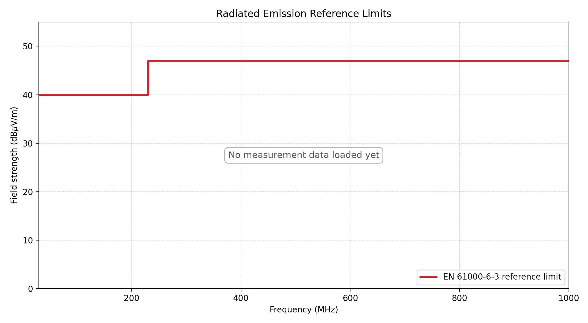

# Identifying Applicable Regulatory EMC Requirements and Pre-Compliance EMC Testing for an Autonomous Parking Robot
*Author: Hampus Huus*

## Introduction

Electromagnetic compatibility (EMC) is an important consideration when developing autonomous robotic systems, because such systems often combine several electronic functions that can generate both conducted and radiated electromagnetic disturbances. If these disturbances are not properly considered, they may cause unacceptable interference with other equipment in the intended environment. European Union regulatory requirements therefore exist to limit such interference, and failure to meet them may prevent the product from being placed on the market or, if already made available on the market, may lead to corrective actions such as withdrawal or even recall. This report investigates which European Union (EU) regulatory EMC requirements and harmonised standards are relevant for this type of system. Because full standard documents are typically licence-based and costly, the project focuses on pre-compliance instead, using a limited set of operating modes and a small number of measurements and mitigation experiments.

## System description and EMC-relevant hardware

The autonomous robot platform(AGV) consists of two NiMH batteries connected in series and a control system built around a mainboard, four separate H-bridge PCBs, sensors, and wireless communication modules. An adjustable LM2596S-based switching regulator is connected directly after the batteries and provides the supply for the H bridge PCBs. The mainboard contains an STM32-based controller for motor control and sensor acquisition, an ESP32-based controller for higher-level communication, and an LMR36520 buck converter for the 3.3 V logic supply. The platform also includes a DWM1001 UWB module, an LSM9DS1 IMU, four AS5600 wheel-position sensors, and ultrasonic distance sensors, all of which are connected to the mainboard using ribbon cables.

The following subsections go through the main parts of the AGV and assess whether they may be potential emission sources, or may contribute to EMC problems through wiring, switching behaviour, or coupling paths. The purpose is not to declare compliance at this stage, but to build a basis for the later measurement work and to support the investigation if significant emissions are found during pre-compliance testing.

### Encoders

The four AS5600 wheel position sensors are read using $230\,Hz$ PWM outputs. Each sensor is connected to the mainboard by an approximately $20\,cm$ cable carrying $3.3\,V$, GND, and PWM. For later EMC analysis, the relevant output parameters from the datasheet [ref:as5600-datasheet] are a PWM slew rate of $0.5$ to $2\,V/\mu s$ and an output current of $0.5\,mA$. The corresponding rise-time-based frequency estimate is:

$$
f_r = \frac{dV/dt}{3.3} = \frac{0.5 \text{ to } 2}{3.3} = 152 \text{ to } 606\,kHz
$$

These values are used as a conservative estimate of the frequency range where the encoder signal edges may still have relevant spectral content. The highest value, $606\,kHz$, is therefore used for the cable length comparison instead of only using the $230\,Hz$ PWM repetition frequency.

$$
\lambda = \frac{c}{f} = \frac{299\,792\,458}{606\,000} = 494.7\,m
$$

For the approximately $0.2\,m$ encoder cable, the ratio between cable length and wavelength is:

$$
\frac{L}{\lambda} = \frac{0.2}{494.7} = 4.04 \times 10^{-4}
$$

This is much smaller than the $0.1\lambda$ rule of thumb for treating a structure as electrically small [ref:paul-emc]. The encoder cable is therefore electrically very short even when the edge based frequency estimate is used. This supports treating the encoder cables as a low radiated emission risk compared with faster and higher current parts of the AGV, such as the H bridge PCBs and motor wiring.

### IMU

The LSM9DS1 IMU [ref:lsm9ds1-datasheet] is connected to the mainboard through an SPI interface with a ribbon cable that is at maximum $20\,cm$. In the present design, the SPI clock is set by:

$$
f_{SPI} = \frac{170\,MHz}{64} = 2.65625\,MHz
$$

The corresponding wavelength is:

$$
\lambda = \frac{c}{f} = \frac{299\,792\,458}{2\,656\,250} = 112.86\,m
$$

For the approximately $0.2\,m$ IMU cable, the ratio between cable length and wavelength at the SPI clock frequency is:

$$
\frac{L}{\lambda} = \frac{0.2}{112.86} = 1.77 \times 10^{-3}
$$

The cable is electrically short at the SPI clock frequency. However, the SPI edges can still contain higher frequency components than the clock frequency itself. Since the SPI slew rate is not currently known, it must be measured before the radiated emission risk from the SPI interface can be estimated more accurately.

### Ultrasonic

The HC-SR04 ultrasonic sensor [ref:hc-sr04-datasheet] is connected to the mainboard through VCC, GND, Trigger, and Echo. The Trigger input is a TTL pulse of at least 10 $\mu$s, and the Echo output is a TTL pulse whose width is proportional to the measured distance. The module operates from 5 $\mathrm{V}$ with a typical working current of 15 $\mathrm{mA}$. The 40 $\mathrm{kHz}$ ultrasonic burst is generated internally by the module after the Trigger pulse, rather than being directly carried on the interface cable. The datasheet [ref:hc-sr04-datasheet] does not specify the rise time, fall time, or slew rate of the Trigger and Echo signals. For later radiated-EMC analysis, these edge rates must therefore be measured on the implemented hardware.

### Batteries

The platform is powered by two NiMH batteries connected in series. The battery cells are not switching sources themselves and are therefore not treated as an active radiated emission source. The EMC relevance is instead the battery wiring, since it is part of the power path that supplies the H bridge PCBs and switching regulators.

For radiated emission, the important factor is whether transient current flows in a large supply loop. Differential mode radiated emission depends on current level, frequency, and loop area $A = Ls$. The battery harness is therefore relevant if the supply and return wiring are separated enough to create a large loop carrying H bridge current transients.

### Mainboard

The mainboard is the common PCB for the STM32 controller, ESP32 controller, sensor connectors, UWB connector, and motor-control connections. It also includes the LMR36520 buck converter for the 3.3 V logic supply. The individual circuits are described in later sections, so the EMC focus here is the routing on the mainboard and how the signal return currents are handled.

The mainboard carries several different signal types. The AS5600 encoder signals are captured as PWM signals at approximately $230\,Hz$. The motor control PWM signals are approximately $20\,kHz$. The DWM1001 UWB module communicates over UART at $115200\,baud$, and the UART between the ESP32 and STM32 also uses $115200\,baud$. The LSM9DS1 IMU is connected over SPI. In the present design the STM32 SPI clock is:

$$
f_{SPI} = \frac{170\,MHz}{64} = 2.65625\,MHz
$$

The nominal frequencies are therefore:

$$
f_{encoder} = 230\,Hz
$$

$$
f_{motorPWM} = 20\,kHz
$$

$$
f_{UART} \approx 115.2\,kHz
$$

$$
f_{SPI} = 2.65625\,MHz
$$

For the mainboard traces themselves, these frequencies are not high enough to make a short PCB trace an efficient radiator by length alone. This can be checked using the wavelength relation:

$$
\lambda = \frac{v}{f}
$$

This relation is used when discussing electrical dimensions, where the important quantity is conductor length compared with wavelength rather than physical length alone. For the highest nominal mainboard signal frequency, $2.65625\,MHz$, the wavelength is:

$$
\lambda_{SPI} = \frac{3 \cdot 10^8}{2.65625 \cdot 10^6} = 112.9\,m
$$

For a typical $50\,mm$ mainboard trace this gives:

$$
\frac{L}{\lambda} = \frac{0.05}{112.9} = 4.43 \cdot 10^{-4}
$$

This is far below the $0.1\lambda$ rule of thumb for treating a structure as electrically small [ref:paul-emc]. Therefore, the SPI trace length itself is not expected to be the dominant radiated-emission problem. The encoder PWM, motor PWM logic signal, and UART traces have even lower nominal frequencies, so their wavelength-based trace-length risk is lower than the SPI case.

This does not mean that the mainboard layout is irrelevant. Digital signals contain high-frequency components depending on rise and fall time, and PCB design must control return paths and loop areas [ref:paul-emc]. Therefore, the important mainboard issue is not the nominal frequency alone, but whether the outgoing trace and its return current stay close together. If a signal trace crosses a weak or broken ground return, the return current must take a longer path. This increases loop area and can increase magnetic coupling and radiated emission.

The pre-compliance measurements for the mainboard should therefore focus on signal quality and coupling, rather than treating the short PCB traces as antennas.

The main EMC concern on the mainboard is therefore the LMR36520 buck layout rather than the short logic traces. The buck has a local high-frequency current loop between the input capacitor, the switching path, ground, and back to the input capacitor. This loop should be kept small, because loop inductance creates voltage disturbance when the current changes quickly:

$$
V_L = L \frac{di}{dt}
$$

For this mainboard, the return path is made with copper pours and several vias instead of a continuous ground plane. This makes via placement important, especially around the buck. The input capacitor is placed close to the buck, and the buck ground return to the input capacitor ground through several nearby vias instead of one shared narrow return path. This reduces common impedance and local ground bounce in the switching current path.

The SW node copper area should be kept small, because it has the fastest voltage transitions on the mainboard. The SW node should also be kept away from SPI, UART, encoder, UWB, and feedback traces. This follows standard PCB EMC guidance [ref:paul-emc], where return-current path, ground grid/vias, power distribution, and loop area are treated as key layout factors.

### H-bridge PCBs

The robot uses four separate self-designed H-bridge PCBs for motor driving. Each full bridge is built from two half bridges. The design uses IRS2008S gate drivers [ref:irs2008s-datasheet] and IPD220N06L3GATMA1 N-channel MOSFETs [ref:ipd220n06l3g-datasheet]. The IRS2008S is a high- and low-side MOSFET driver, while the IPD220N06L3GATMA1 is a 60 V power MOSFET. This makes the H-bridge PCBs one of the more important EMC risk areas in the AGV, because they combine fast gate drive, MOSFET switching, motor current, and external motor wiring.

The motor PWM frequency is approximately $20\,kHz$. The larger EMC risk comes from the switching edges and the current loop formed by the H-bridge, motor cable, motor winding, and return path. These loops can create radiated emissions, while the same switching current can also create conducted disturbances on the supply wiring.

According to the IRS2008S datasheet [ref:irs2008s-datasheet], the driver has typical source and sink currents of $290\,mA$ and $600\,mA$. Under the datasheet test conditions, it also gives a typical turn-on rise time of $70\,ns$ and a typical turn-off fall time of $30\,ns$. Together with the MOSFET data [ref:ipd220n06l3g-datasheet], this indicates fast switching rather than slow edge shaping.

A simple edge-time estimate is

$$
f_c \approx \frac{1}{2\pi\tau} = \frac{2.2}{2\pi t_r} \approx \frac{0.35}{t_r}
$$

This gives approximately $5\,MHz$ for $t_r = 70\,ns$ and approximately $12\,MHz$ for $t_r = 30\,ns$. The H-bridge can therefore create strong harmonic content and ringing well above the $20\,kHz$ PWM fundamental.

The H-bridge should therefore be treated as a primary suspect if peaks or a raised noise floor appear during motor operation and are not present in standby. The most likely coupling paths are the motor cables, the battery supply wiring, and the local switching current loop on each H-bridge PCB. The actual switch-node $dV/dt$ still depends on the implemented layout, wiring, and loading, and must therefore be confirmed by measurement on the implemented H-bridge PCB and its wiring.

### LM2596S-based switching regulator

The LM2596S-based switching regulator is a purchased buck module used between the batteries and the H bridge PCBs and mainboard. Like the LMR36520, the regulator IC itself is considered a lower-probability EMC problem than the surrounding power wiring and implementation, since it is a commercial regulator IC rather than a self-designed switching stage. It is still notable that the module switches at approximately $150\,kHz$ [ref:lm2596-datasheet], which can create conducted ripple on the supply wiring.

### STM32-based controller

The STM32-based controller uses an STM32G474RE microcontroller. This is a commercial microcontroller from STMicroelectronics, not a self-designed digital circuit. According to the datasheet [ref:stm32g474re-datasheet], the STM32G474RE can operate at up to $170\,MHz$. This makes it one of the highest-frequency digital devices in the AGV, and therefore EMC relevant even though the controller itself is not expected to be the same type of emission source as the motor drive or switching regulators.

### ESP32-based controller

The ESP32 based controller uses an ESP32 WROOM 32 module [ref:esp32-wroom-32-datasheet]. The module contains the ESP32 microcontroller and the RF parts needed for 2.4 GHz WiFi and Bluetooth communication [ref:esp32-wroom-32-datasheet]. In this project, the ESP32 runs at $240\,MHz$ [ref:esp32-wroom-32-datasheet], which makes it one of the highest frequency digital components in the AGV.

The ESP32 is used for Bluetooth communication and for UART communication with the STM32 at $115200\,baud$. The UART interface is not expected to be a dominant emission source by frequency, but the ESP32 module is still EMC relevant because it contains both a high frequency digital controller and a 2.4 GHz radio.

The radio regulatory part is outside the scope of this report. In the emission analysis, Bluetooth activity is therefore treated separately from the unintentional emissions of the AGV electronics. Emissions around $2.4\,GHz$ are expected from the ESP32 Bluetooth radio when it is active, while the motor drive, buck regulators, and wiring are treated as the relevant sources for unintentional emissions.

### LMR36520 buck converter

The LMR36520 is a documented commercial synchronous buck regulator from Texas Instruments, not a self-designed switching stage. According to the datasheet [ref:lmr36520-datasheet], it includes integrated high side and low side MOSFETs, internal compensation, and operates as a 4.2 V to 65 V, 2 A step down converter [ref:lmr36520-datasheet]. The datasheet [ref:lmr36520-datasheet] does not state that the IC itself meets EU EMC emission limits, and the responsibility for meeting EMC requirements is still on the final AGV product.

Nevertheless, since the LMR36520 is a commercial IC from a major semiconductor manufacturer and is intended to be used in many different products, it is reasonable to assume that the IC itself is less likely to be the main EMC problem than the surrounding buck implementation. For this project, the more probable EMC problem areas are therefore the PCB layout around the buck, especially the input loop, SW node, inductor, output capacitors, and return path.

### DWM1001 UWB module

The DWM1001 UWB module [ref:dwm1001-datasheet] is a commercial radio module used for global positioning. Since the regulatory radio part, such as EU RED compliance for the UWB transmitter, is outside the scope of this project, the UWB module is not connected during the pre-compliance emission measurements.

## Intended environment and practical classification

The AGV is intended to operate as an autonomous parking robot in an indoor parking garage. The parking garage is intended to be fully automated, meaning that the customer leaves the vehicle at an entrance area before the AGV picks it up and parks it inside the garage. The robot is therefore not intended to operate freely in a normal public area with pedestrians around it, but in a controlled area inside the parking facility.

This makes the intended environment a light industrial environment in this project. The parking facility is a commercial service, but the robot operates in a restricted technical area where automated equipment is expected to be used. The environment is therefore more demanding than a normal office or home environment, but it is probably not treated as a heavy industrial environment such as a factory, welding area, or production line.

For this reason, the AGV is practically classified in this report as equipment intended for a light industrial indoor environment.

## Applicable standards and how they are identified

To identify the applicable harmonised EMC emission standards, the European Commission [ref:ec-emc-directive] webpage for harmonised standards under the EMC Directive 2014/30/EU was used as the starting point. This page provides a ``Summary list of titles and references of harmonised standards under Directive 2014/30/EU for EMC'', available as a downloadable PDF or spreadsheet. The summary list contains, among other information, the reference number of each standard and the title of the standard.

The list was first reviewed by comparing the standard titles with the intended environment and function of the AGV.

The following candidate standards were selected from the summary list for further comparison:

**Candidate harmonised EMC standards selected from the summary list under Directive 2014/30/EU.**

| {@{}p{0.32\linewidth}p{0.62\linewidth}@{}} **Standard** | **Title in the summary list** |
| --- | --- |
| EN 61800-3:2004+A1:2012 | Adjustable speed electrical power drive systems, Part 3: EMC requirements and specific test methods |
| EN 61000-6-3:2007+A1:2011 | Electromagnetic compatibility (EMC), Part 6-3: Generic standards, Emission standard for residential, commercial and light-industrial environments |
| EN 61000-6-4:2007+A1:2011 | Electromagnetic compatibility (EMC) - Part 6-4: Generic standards - Emission standard for industrial environments |
| EN 14010:2003+A1:2009 | Safety of machinery, Equipment for power driven parking of motor vehicles, Safety and EMC requirements for design, manufacturing, erection and commissioning stages |

The best fit is EN 14010:2003+A1:2009, *Safety of machinery --- Equipment for power driven parking of motor vehicles --- Safety and EMC requirements for design, manufacturing, erection and commissioning stages*.

As this standard is licence-based, it cannot be referenced in detail directly in this report. However, EN 14010 does not itself define a separate dedicated EMC emission limit set. Instead, it states that the electromagnetic disturbances generated by the power driven parking equipment shall not exceed the levels specified in the generic emission standard EN 61000-6-3.

For this reason, the practical EMC focus in this report is placed on EN 61000-6-3, *Electromagnetic compatibility (EMC), Part 6-3: Generic standards, Emission standard for residential, commercial and light-industrial environments*.

Since EN 61000-6-3 is also licence-based, this test report does not claim formal conformity with the standard. The standard is therefore not used directly as a complete test method document in this report. Instead, it is used only as a practical pre-compliance reference, and the numerical limits used in the measurements are taken from publicly available secondary sources that reference EN 61000-6-3.

**Secondary sources used for practical radiated-emission reference limits.**

| {@{}p{0.25\linewidth}p{0.24\linewidth}p{0.16\linewidth}p{0.27\linewidth}@{}} **Frequency range** | **Limit** | **Page** | **Source** |
| --- | --- | --- | --- |
| $30\,MHz$ to $230\,MHz$ | $40\,dB\mu V/m$ QP at $3\,m$ | p. 8 of 20 | BK Services EMC report [ref:bk-superchrono] |
| $230\,MHz$ to $1000\,MHz$ | $47\,dB\mu V/m$ QP at $3\,m$ | p. 8 of 20 | BK Services EMC report [ref:bk-superchrono] |
| $30\,MHz$ to $230\,MHz$ | $40\,dB\mu V/m$ QP at $3\,m$ | p. 33 | Vecow, CE EMC Test Report [ref:vecow-ce-emc] |
| $230\,MHz$ to $1000\,MHz$ | $47\,dB\mu V/m$ QP at $3\,m$ | p. 33 | Vecow, CE EMC Test Report [ref:vecow-ce-emc] |
| $30\,MHz$ to $230\,MHz$ | $40\,dB\mu V/m$ QP at $3\,m$ | p. 8 of 17, section 6.1 | Adeo, EMC Test Report, EN 61000-6-3 [ref:adeo-emc] |
| $230\,MHz$ to $1000\,MHz$ | $47\,dB\mu V/m$ QP at $3\,m$ | p. 8 of 17, section 6.1 | Adeo, EMC Test Report, EN 61000-6-3 [ref:adeo-emc] |

Based on the secondary sources, it can be inferred that the practical EN 61000-6-3 radiated-emission reference limits at $3\,m$ are $40\,dB\mu V/m$ from $30\,MHz$ to $230\,MHz$, and $47\,dB\mu V/m$ from $230\,MHz$ to $1000\,MHz$, using a quasi-peak detector.

## Method and measurement plan

EN 61000-6-3 points to EN 55016-2-3 for the radiated emission test method. However, EN 55016-2-3 is also licence based and can therefore not be used directly in this test report. Since the available setup is a pre-compliance test chamber and not a full or semi anechoic chamber, the measurement will deviate too much from the official method for a detailed investigation of EN 55016-2-3 to be relevant in this project.

The available setup is not a full or semi anechoic chamber, and the measurement distance is expected to be shorter than $3\,m$. The results are therefore not treated as formal EN 61000-6-3 results. Instead, the measurements are used as a pre-compliance scan to identify possible emission problems. To add margin for the limited setup, all measured results should be at least $6\,dB$ below the practical reference limit. Since the limits are given in $dB\mu V/m$, this corresponds to approximately a factor of two in field strength.

The chamber measurements use a peak detector rather than a quasi-peak detector. Peak results are therefore not directly equivalent to the quasi-peak limits used in the practical reference, but they are still useful for pre-compliance because they conservatively show where strong emissions occur.

Because a new measurement setup is not feasible, the borrowed chamber will be used with its preset settings. These settings are not necessarily identical to those in the formal standard method, and because the chamber is borrowed from Husqvarna, the exact setup cannot be disclosed in this report.

The measurement system still covers the relevant radiated-emission frequency range. In this project, the practical comparison to the identified EN 61000-6-3 reference limits is made over $30\,MHz$ to $1\,GHz$.

Because this is a pre-compliance investigation, the purpose is not to declare formal pass/fail, but to identify peaks that are close to the practical reference limit. In this report, particular attention is therefore given to peaks within $6\,dB$ of the reference limit, or above it. If such peaks are found, the analysis from Section 2 will be used to assess which subsystem may be responsible for the emission. If the calculations do not clearly suggest the source, a spectral probe can also be used to scan locally over the components and look for the same frequency peak near a likely source.

The main selected measurement is radiated emission from the complete AGV. This is treated as an enclosure-port measurement, meaning that the robot is evaluated as one radiating product including the mainboard, H-bridge PCBs, motor wiring, switching regulators, controllers, and external cables.

The AGV is measured in operating modes that are expected to create the highest unintentional emissions. The most important mode is motor operation, because the self-designed H-bridge PCBs switch motor current and are connected to external motor wiring. The switching regulators and controllers are also active during this mode, so that the measured result represents the complete AGV electronics.

Two operating modes are planned: standby and running. In standby mode, the AGV electronics are powered but the motors are not running. In running mode, the AGV drives forward using \texttt{set_drive_forward_mm(x)}.

This work requires access to the borrowed pre-compliance chamber and measurement time at Husqvarna AB. At the time of writing, that work had not yet been carried out, so Sections 6--9 are limited to the parts that depend on the measurement plan described here.

## Pre-compliance measurements and results

This section depends on the measurement work described in Section 6 and is therefore left for future work.

*Planned radiated-emission plot format with the EN 61000-6-3 reference limit, the $6\,dB$ below-limit screening line, and no measured data yet added.*

## Mitigation actions and evaluation

This section depends on the measurement work described in Section 6 and is therefore left for future work.

## Discussion

This section depends on the measurement work described in Section 6 and is therefore left for future work.

AI-assisted search was used to help find public secondary sources, since this differs from the official way of accessing licence-based standards. AI was also used for spelling correction and LaTeX formatting.

## Conclusions and future work

This section depends on the measurement work described in Section 6 and is therefore left for future work.

## References

1. Paul, Clayton R., Scully, Robert C., and Steffka, Mark A., *Introduction to Electromagnetic Compatibility*, 3rd ed., Wiley, 2022.
2. European Commission, ``Electromagnetic Compatibility (EMC) Directive'': [single-market-economy.ec.europa.eu/.../electromagnetic-compatibility-emc-directive_en](https://single-market-economy.ec.europa.eu/sectors/electrical-and-electronic-engineering-industries-eei/electromagnetic-compatibility-emc-directive_en)
3. [AS5600 datasheet (look.ams-osram.com)](https://look.ams-osram.com/m/7059eac7531a86fd/original/AS5600-DS000365.pdf?)
4. [LSM9DS1 product page and datasheet (STMicroelectronics)](https://www.st.com/en/mems-and-sensors/lsm9ds1.html)
5. [HC-SR04 datasheet (Elecfreaks PDF mirrored by SparkFun)](https://cdn.sparkfun.com/datasheets/Sensors/Proximity/HCSR04.pdf)
6. [IRS2008S product page and datasheet (Infineon)](https://www.infineon.com/cms/en/product/power/gate-driver-ics/irs2008s/) 7. [IPD220N06L3GATMA1 product page and datasheet (Infineon)](https://www.infineon.com/cms/en/product/power/mosfet/n-channel/ipd220n06l3-g/) 8. [LM2596 product page and datasheet (Texas Instruments)](https://www.ti.com/product/LM2596) 9. [STM32G474RE product page and datasheet (STMicroelectronics)](https://www.st.com/en/microcontrollers-microprocessors/stm32g474re.html) 10. [ESP32-WROOM-32 datasheet (Espressif)](https://www.espressif.com/sites/default/files/documentation/esp32-wroom-32_datasheet_en.pdf) 11. [LMR36520 product page and datasheet (Texas Instruments)](https://www.ti.com/product/LMR36520) 12. [DWM1001 datasheet (Qorvo)](https://store.qorvo.com/datasheets/qorvo/dwm1001datasheet.pdf) 13. [BK Services, EMC Test Report SuperChrono, EN 61000-6-3:2007, radiated emission data](https://www.steinertsensingsystems.com/wp-content/uploads/2013/06/Certificate-of-Compliance-CE-FCC-SuperChrono-1.pdf) 14. [Vecow, CE EMC Test Report, radiated-emission data on p. 33](https://www.vecow.com/dispUploadBox/PJ-VECOW/Files/10276.pdf) 15. [Adeo-hosted EMC Test Report, EN 61000-6-3 radiated-emission limits in section 6.1](https://media.adeo.com/media/1320160/media.pdf)

> This README is generated from the LaTeX source files. Edit the `.tex` files, not this document.
